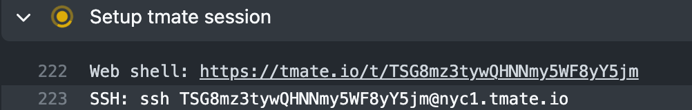

# Contributing to Hydrogen

> Tip:
> Looking for [releasing instructions](releasing.md)?

**Requirements:**

- Node.js version 16.14.0 or higher
- Yarn

```bash
git clone git@github.com:Shopify/hydrogen.git
yarn
yarn dev
```

To develop against a template, open a new terminal window or tab and choose from the available templates:

- templates/demo-store
- templates/hello-world-ts

```bash
cd templates/demo-store
yarn dev
```

Visit the dev environment at http://localhost:3000.

To make changes to the Demo Store template, edit the files in `templates/demo-store`.

To modify Hydrogen framework, components, and hooks, edit the files in `packages/hydrogen`.

You can [inspect Vite plugin](https://github.com/antfu/vite-plugin-inspect) transformations by visiting `http://localhost:3000/__inspect`.

During local development, you can use `LOCAL_DEV` environment variable to enable
Hydrogen file watching when running templates or examples. This variable also disables file hashing and minification when building locally.

```bash
$ export LOCAL_DEV=true
$ yarn [dev|build]
```

## Context

Hydrogen is a Yarn v1 monorepo. It consists of several key packages:

- `examples`: Illustrative proofs of concept demonstrating integrations and special use cases for Hydrogen
- `templates`: Full working implementations of a Hydrogen storefront (including the Demo Store template)
- `packages/hydrogen`: The Hydrogen React framework & SDK
- `packages/playground`: Test cases used for both manual testing and automated end-to-end tests

For more information, check out the following resources:

- [Decisions](../docs/decisions/)
- [Decision Log (outdated)](./contributing/decisions.md)
- [Principles & Assumptions](./contributing/principles.md)

## Formatting and Linting

Hydrogen uses ESLint for linting and Prettier for code formatting.

[Yorkie](https://github.com/yyx990803/yorkie) is used to install a Git precommit hook, which lints and formats staged commits automatically.

To manually lint and format, first build your Hydrogen app:

```bash
yarn build
```

And run:

```bash
yarn lint
yarn format
```

## Naming conventions

Hydrogen follows common React naming conventions for filenames, component names, classes, constants, and more.

- For component **filenames** and **class names**, always use `PascalCase`.
- For **non-component filenames**, always use fully lowercase `kebab-case`.
- For **test filenames**, append `.test` before the file extension.
- When declaring **instances** of components, always use `camelCase`.
- When declaring **exported constants**, always use `SCREAMING_SNAKE_CASE`.

| &nbsp;                       | ✅ Valid                                        | 🚫 Invalid                                                                          |
| ---------------------------- | ----------------------------------------------- | ----------------------------------------------------------------------------------- |
| **Component filenames:**     | `ProductTitle.tsx`<br>`ProductTitle.client.tsx` | `productTitle.tsx`<br>`product_title.tsx`<br>`product-title.client.tsx`             |
| **Non-component filenames:** | `client.ts`<br>`handle-event.ts`                | `Client.ts`<br>`handleEvent.ts`<br>`handle_event.ts`                                |
| **Test filenames:**          | `ExternalVideo.test.tsx`                        | `ExternalVideo-test.tsx`<br>`ExternalVideo_test.tsx`<br>`ExternalVideoTest.tsx`     |
| **Component classes:**       | `<AddToCartButton />`                           | `<addToCartButton />`                                                               |
| **Component instances:**     | `const cartSelector = <CartSelector />`         | `const CartSelector = <CartSelector />`<br>`const cart_selector = <CartSelector />` |
| **Exported constants:**      | `export const CART_COOKIE_TTL_DAYS = 14;`       | `export const CartCookieTTLDays = 14;`<br>`export const cart_cookie_ttl_days = 14;` |

## Changesets

If you are contributing a user-facing or noteworthy change to Hydrogen that should be added to the changelog, you should include a changeset with your PR.

To add a changeset, run this script locally:

```bash
yarn changeset add
```

Follow the prompts to select which package(s) are affected by your change, and whether the change is a major, minor or patch change. This will create a file in the `.changesets` directory of the repo. This change should be committed and included with your PR.

Considerations:

- You can use markdown in your changeset to include code examples, headings, and more. However, **please use plain text for the first line of your changeset**. The formatting of the GitHub release notes does not support headings as the first line of the changeset.
- When selecting packages for the changesets, only select packages which are published. Do not include private packages, as it will cause the build to fail. _Hopefully these are removed from the list of options in a [future Changesets release](https://github.com/changesets/changesets/issues/436)_.

## Contributing Examples

Hydrogen welcomes example projects to the repository to showcase different types of Hydrogen integrations inside the `/examples` folder.

To contribute a new example, start by creating a folder in the `/examples` directory:

```bash
mkdir examples/EXAMPLE_NAME
```

Next, add a `README.md` with instructions for installing and running your example. Be sure to update the StackBlitz and `npx degit` URLs with your example folder name:

````md
# EXAMPLE_NAME Example

Hydrogen is a React framework and SDK that you can use to build fast and dynamic Shopify custom storefronts.

[Check out the docs](https://shopify.dev/custom-storefronts/hydrogen)

[Run this example on StackBlitz](https://stackblitz.com/fork/github/shopify/hydrogen/tree/stackblitz/examples/EXAMPLE_NAME)

## Getting started

**Requirements:**

- Node.js version 16.14.0 or higher
- Yarn

```bash
npx degit Shopify/hydrogen/examples/EXAMPLE_NAME hydrogen-app
yarn
yarn dev
```

Remember to update `hydrogen.config.js` with your shop's domain and Storefront API token!
````

Finally, add the minimum amount of code necessary to properly demonstrate the features of your example.

Inside `package.json`, you must always use `latest` as the Hydrogen version.

When you are ready, submit your PR for approval. Upon acceptance, a Hydrogen team member will merge your PR. Note that the example will not be available on StackBlitz or `npx degit` until the next time the "Publish to StackBlitz" GitHub Action runs, which is after a new release.

## Merging PRs

When merging PRs, please select the **Squash and Merge** option, which consolidates all the changes from the PR into a single commit. This helps reduce the commit noise in our Git repository.

## Headless components

If you are building or making changes to a component, be sure to read [What are headless components?](./contributing/headlesscomponents.md) and [How to build headless components](./contributing/howtobuildheadless.md).

## Storefront API TypeScript types

You can directly import the TypeScript type from `/packages/src/storefront-api-types.ts` which will match the full shape of the object from the Storefront API. If you're working on a component, you're not guarnateed to get an object in the exact shape as that type, so wrap it in `PartialDeep` which is imported from `type-fest`. This will also force the component to be more defensive in handling optional properties.

To update the types, follow the steps below, excluding the parts where you update the version.

### Updating GraphQL and TypeScript types to a new Storefront API version

We use `graphql-codegen` to automatically generate types for all of the Storefront API objects for a given version, and that version can be found in the `codegen.yml` file.

In order to update the supported Storefront API version:

1. Update the Schema URL and the header comment in `codegen.yml`
1. Run `yarn graphql-types`
1. Fix any TypeScript errors that now appear
   1. One fast way to find them is to run `yarn build` from the monorepo root and see what TypeScript errors show up
   1. Another way is to clear the test cache with `yarn test --clearCache && yarn test`

For context, updating the `codegen.yml` file and running the script does the following:

1. Automatically hits the Storefront API, and use an introspection query to get the latest info
1. Uses the results of that query to generate a new `graphql.schema.json` (which is a local representation of the Storefront API)
1. Generates / updates the new types in `/packages/hydrogen/src/storefront-api-types.ts` based on the `graphql.schema.json`

## Testing

Hydrogen is tested with unit tests for components, hooks and utilities. It is also tested with a suite of end-to-end tests inspired by [Vite's playground tests](https://github.com/vitejs/vite/tree/main/packages/playground).

Run unit tests with:

```bash
yarn test

# Optionally watch for changes
yarn test --watch
```

Run end-to-end tests with:

```bash
yarn test-e2e

# Optionally watch for changes
yarn test-e2e --watch
```

### Debugging tests in Github Actions

Tests that fail **only** in CI can be difficult and time-consuming to debug. If you find yourself in this situation, you can use [tmate](https://tmate.io/) to pause the Github Action on a given step and `ssh` into the container. Once in the container you can use `vim`, inspect the file system and try determining what might be diverging from running tests on your local computer and leading to the failure.

- Add the following `step` in your Github Actions workflow:

```yaml
- name: Setup tmate session
  uses: mxschmitt/action-tmate@v3
```

- Commit and push your changes to Github.
- The testing Github Action will run automatically and you will see it paused with both a Web Shell address and SSH address.



- Copy and paste the SSH address into your terminal.

### End-to-end tests

End-to-end tests are powered by [Playwright and Chromium](https://playwright.dev/). They are modeled closely after how [Vite handles E2E tests](https://github.com/vitejs/vite/tree/main/packages/playground).

Each mini-project under `packages/playground` contains a tests folder. You are welcome to modify an existing project or add a new project if it represents a different framework scenario, e.g. using a specific CSS framework or integration.

You can run a single E2E test by passing a keyword, which is matched using regex, e.g. `yarn test-e2e server` will run the `server-components` test.

## Updating the `react-server-dom-vite` vendored plugin

We have an [open PR](https://github.com/facebook/react/pull/22952) for `react-server-dom-vite`, which powers server components in Hydrogen. We're still aligning with the React team on this implementation.

In the meantime, we vendor the contents of the compiled plugin in `packages/hydrogen/vendor/react-server-dom-vite`.

To make updates to the plugin:

1. Clone the `facebook/react` repo and install dependencies.
1. Check out Fran's PR above. We recommend using the GitHub CLI and running `gh pr checkout 22952`.
1. Build _just_ the plugin with `yarn build vite`.
1. Copy the output of the plugin to Hydrogen. This command might vary depending on your directory structure: `cp -rf build/node_modules/react-server-dom-vite ../../Shopify/hydrogen/packages/hydrogen/vendor/`
1. Delete the `packages/hydrogen/vendor/react-server-dom-vite/umd` folder. We don't need it in Hydrogen.
1. Tell @frandiox what changes you made, as we need to use that personal branch to make changes upstream into the React PR.

Eventually this will not be vendored and we can delete these instructions!
