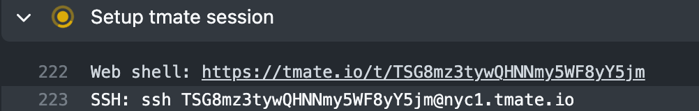

# Contributing to Hydrogen

**Requirements:**

- Node.js version 16.5.0 or higher
- Yarn

```bash
git clone git@github.com:Shopify/hydrogen.git
yarn
yarn dev
```

Visit the dev environment at http://localhost:3000.

To make changes to the starter template, edit the files in `examples/template-hydrogen-default`.

To modify Hydrogen framework, components, and hooks, edit the files in `packages/hydrogen`.

You can [inspect Vite plugin](https://github.com/antfu/vite-plugin-inspect) transformations by visiting `http://localhost:3000/__inspect`.

## Context

Hydrogen is a Yarn v1 monorepo. It consists of several key packages:

- `examples/template-hydrogen-default`: The starter template
- `packages/hydrogen`: The Hydrogen React framework & SDK
- `packages/create-hydrogen-app`: The CLI used to scaffold new projects
- `packages/cli`: The CLI used to perform tasks in a Hydrogen app
- `packages/playground`: Test cases used for both manual testing and automated end-to-end tests

For more information, check out the following resources:

- [Decision Log](./contributing/decisions.md)
- [Principles & Assumptions](./contributing/principles.md)

## Formatting and Linting

Hydrogen uses ESLint for linting and Prettier for code formatting.

[Yorkie](https://github.com/yyx990803/yorkie) is used to install a Git precommit hook, which lints and formats staged commits automatically.

To manually lint and format:

```bash
yarn lint
yarn format
```

## Naming conventions

Hydrogen follows common React naming conventions for filenames, component names, classes, constants, and more.

- For component **filenames** and **class names**, always use `PascalCase`.
- For **non-component filenames**, always use fully lowercase `kebab-case`.
- For **test filenames**, append `.test` before the file extension.
- When declaring **instances** of components, always use `camelCase`.
- When declaring **exported constants**, always use `SCREAMING_SNAKE_CASE`.

| &nbsp;                       | ✅ Valid                                        | 🚫 Invalid                                                                          |
| ---------------------------- | ----------------------------------------------- | ----------------------------------------------------------------------------------- |
| **Component filenames:**     | `ProductTitle.tsx`<br>`ProductTitle.client.tsx` | `productTitle.tsx`<br>`product_title.tsx`<br>`product-title.client.tsx`             |
| **Non-component filenames:** | `client.ts`<br>`handle-event.ts`                | `Client.ts`<br>`handleEvent.ts`<br>`handle_event.ts`                                |
| **Test filenames:**          | `ExternalVideo.test.tsx`                        | `ExternalVideo-test.tsx`<br>`ExternalVideo_test.tsx`<br>`ExternalVideoTest.tsx`     |
| **Component classes:**       | `<AddToCartButton />`                           | `<addToCartButton />`                                                               |
| **Component instances:**     | `const cartSelector = <CartSelector />`         | `const CartSelector = <CartSelector />`<br>`const cart_selector = <CartSelector />` |
| **Exported constants:**      | `export const CART_COOKIE_TTL_DAYS = 14;`       | `export const CartCookieTTLDays = 14;`<br>`export const cart_cookie_ttl_days = 14;` |

## Changesets

If you are contributing a user-facing or noteworthy change to Hydrogen that should be added to the changelog, you should include a changeset with your PR.

To add a changeset, run this script locally:

```bash
yarn changeset add
```

Follow the prompts to select which package(s) are affected by your change, and whether the change is a major, minor or patch change. This will create a file in the `.changesets` directory of the repo. This change should be committed and included with your PR.

> **Important**: Until our official release, we will only release `minor` and `patch` updates. This means that breaking changes will be included in minor releases. Once we officially launch Hydrogen, we'll switch to `1.0.0` and follow a normal semantic release pattern.

## Merging PRs

When merging PRs, please select the **Squash and Merge** option, which consolidates all the changes from the PR into a single commit. This helps reduce the commit noise in our Git repository.

## Headless components

If you are building or making changes to a component, be sure to read [What are headless components?](./contributing/headlesscomponents.md) and [How to build headless components](./contributing/howtobuildheadless.md).

## GraphQL Types

### Updating the auto-generated Typescript types, or updating the `.graphql` files

If you make changes to or add any new `.graphql` files within Hydrogen, you will need to run the following commands in order to generate the type definitions and Graphql documents for the newly added/updated files:

```bash
yarn graphql-types
```

The Typescript types are then automatically generated from the `.graphql` query in those files.

### Creating Typescript types for Storefront API objects without a `.graphql` file

If you would like to use a type for a Storefront API object without using a GraphQL query / fragment to generate it, you can directly import the Typescript type from `/packages/src/graphql/types/types.ts` which will match the full shape of the object from the Storefront API. From there, you can use things like Typescript's `Pick` or `Omit` helpers to create the shape you need.

### Updating GraphQL and Typescript types to a new Storefront API version

We use `graphql-codegen` to automatically generate types for all of the Storefront API objects for a given version, and that version can be found in the `codegen.yml` file.

In order to update the supported Storefront API version:

1. Update the URL in `codegen.yml`
1. Run `yarn graphql-types`
1. Fix any Typescript errors that now appear
   1. One fast way to find them is to run `yarn build` from the monorepo root and see what Typescript errors show up
   1. Another way is to clear the test cache with `yarn test --clearCache` and then run the tests with `yarn test`

For context, updating the `codegen.yml` file and running the script does the following:

1. Automatically hits the Storefront API, and use an introspection query to get the latest info
1. Uses the results of that query to generate a new `graphql.schema.json` (which is a local representation of the Storefront API)
1. Generates / updates the new types in `/packages/src/graphql/types/types.ts` based on the `graphql.schema.json`
1. Generates / updates the types in each `[Name]Fragment.ts` file

## Running a local version of Hydrogen in a Hydrogen app

> Caution:
> You must use `yarn` for all commands, due to issues with NPM and dependencies, even if the prompt tells you to use `npm`.

Follow these instructions to create your own Hydrogen app using the local development version of the Hydrogen framework.

Before running any commands, be sure to build the Hydrogen lib with `yarn dev-lib` or `yarn build`.

```bash
cd packages/create-hydrogen-app && yarn link
```

This makes the executable `create-hydrogen` available globally.

Next, choose an option below.

### Option 1: `localdev` package

This option creates a new Hydrogen app similar to `examples/template-hydrogen-default` directly in the monorepo under `packages/localdev`. This directory is ignored in git, so your changes will not be tracked.

```terminal
create-hydrogen packages/localdev
# when prompted, use `localdev` for the package name
```

Then run your app:

```terminal
yarn workspace localdev dev
```

### Option 2: Standalone package

> Caution:
> This requires you to have a directory structure on your machine like `~/src/github.com/Shopify/*`, and it requires you to create your custom Hydrogen app in a namespace similar to `~/src/github.com/<namespace>/<your hydrogen app here>`.

1. In the directory you want to create your Hydrogen app, run `LOCAL=true create-hydrogen` and answer the prompts.
1. Run `cd <your app>`.
1. Run `yarn` or `npm i --legacy-peer-deps`.
1. Optional. Replace default `shopify.config.js` with your own storefront credentials.
1. Run `yarn dev` or `npm run dev` to start your dev server.
1. Open the dev server in your browser at http://localhost:3000.

If you make changes to core Hydrogen packages, then you'll need to delete `node_modules`, install dependencies again and start the server as mentioned above.

## Testing

Hydrogen is tested with unit tests for components, hooks and utilities. It is also tested with a suite of end-to-end tests inspired by [Vite's playground tests](https://github.com/vitejs/vite/tree/main/packages/playground).

Run unit tests with:

```bash
yarn test

# Optionally watch for changes
yarn test --watch
```

Run end-to-end tests with:

```bash
yarn test-e2e

# Optionally watch for changes
yarn test-e2e --watch
```

### Debugging tests in Github Actions

Tests that fail **only** in CI can be difficult and time-consuming to debug. If you find yourself in this situation, you can use [tmate](https://tmate.io/) to pause the Github Action on a given step and `ssh` into the container. Once in the container you can use `vim`, inspect the file system and try determining what might be diverging from running tests on your local computer and leading to the failure.

- Add the following `step` in your Github Actions workflow:

```yaml
- name: Setup tmate session
  uses: mxschmitt/action-tmate@v3
```

- Commit and push your changes to Github.
- The testing Github Action will run automatically and you will see it paused with both a Web Shell address and SSH address.



- Copy and paste the SSH address into your terminal.

### End-to-end tests

End-to-end tests are powered by [Playwright and Chromium](https://playwright.dev/). They are modeled closely after how [Vite handles E2E tests](https://github.com/vitejs/vite/tree/main/packages/playground).

Each mini-project under `packages/playground` contains a tests folder. You are welcome to modify an existing project or add a new project if it represents a different framework scenario, e.g. using a specific CSS framework or integration.

You can run a single E2E test by passing a keyword, which is matched using regex, e.g. `yarn test-e2e server` will run the `server-components` test.

## Releasing new versions

Hydrogen versions are determined exclusively by [changesets](https://github.com/changesets/changesets). When new changesets are merged into a release branch like `v1.x-2022-07`, a new PR will be automatically created containing the proposed version.

This PR can stay open and will be continously updated by the changesets bot until you are ready to merge.

When you are ready to release a new version of Hydrogen, merge the PR created by the changesets bot. This will convert all changesets into appropriate `CHANGELOG` files, add Git tags, and create GitHub releases for each package contained in the release.

Next, visit the Shipit page for Hydrogen containing the version you intend to release, e.g. `Hydrogen v1.x-2022-07`. Click **Deploy** on the merge commit that was recently created.

## Releasing unstable versions

Hydrogen maintains an `unstable` branch as a home for features and breaking changes related to the `unstable` version of the Storefront API.

To release an unstable version:

1. Merge your changes into the `unstable` branch.
1. Visit the Shipit page for `Hydrogen Unstable` and click **Deploy** on the commit you want to release

A new snapshot release will be created with your changes and tagged on NPM with `unstable`. You can install the unstable version of Hydrogen using this tag:

```bash
yarn add @shopify/hydrogen@unstable

# or start a new project:
npx create-hydrogen-app@unstable
```

## Testing changes in another project

From the root of the repo, run:

```bash
yarn tophat ../PATH/TO/PROJECT --packages [...PACKAGES_LIST]


# example
yarn tophat ../cartogram/hydrogen-shop --packages cli hydrogen eslint-plugin

```
